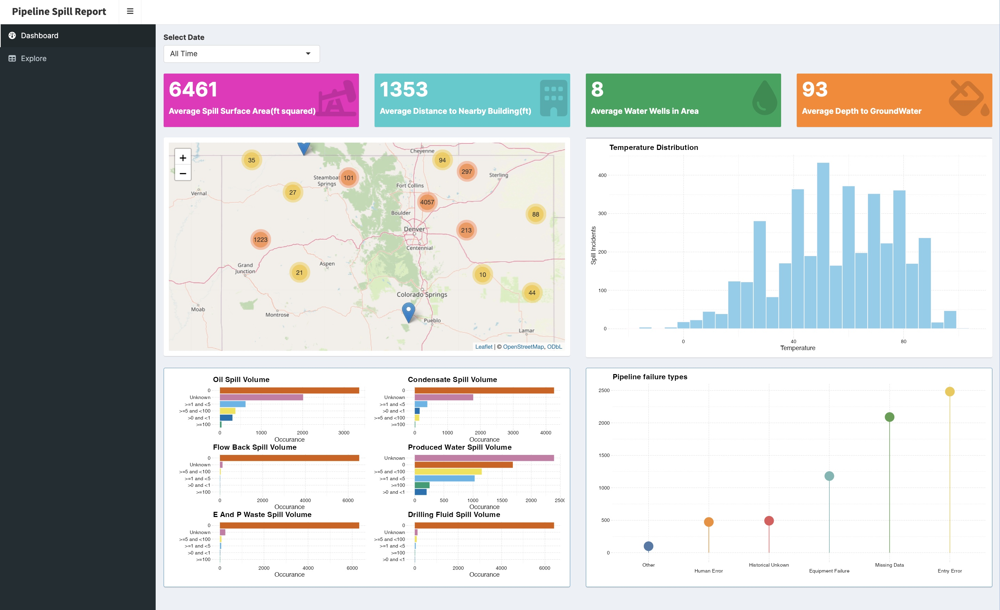

<h4> Dataset </h4>

> Dataset taken from [ECMC](https://ecmc.state.co.us/data2.html#/downloads) (Colorado Energy and Carbon Management Commission) under their spills dataset

The dashboard helper function does some preliminary data cleaning, removing duplicates, data correction, and parsing numerical values. 

<h4> Tableau Version </h4>

> An alternative dashboard was created in Tableau as well with more customization 

   

[link](https://public.tableau.com/app/profile/zhang.lin2425/viz/ECMC_Dashboard/PipelineSummary) to dashboard 

<h4> Results </h4>

EDA's of R code are summarized in shiny dashboard below, maintained until Oct/2023. 

   

